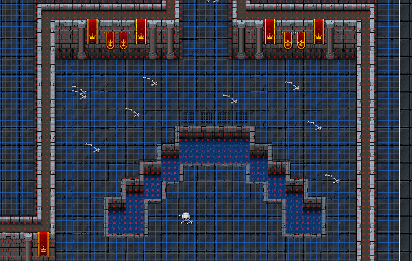
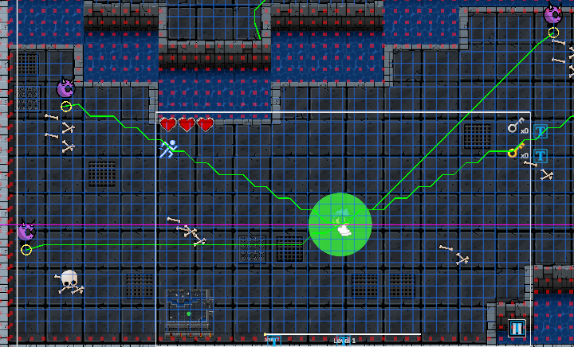

# Bullet Catacomb

This project was developed as part of a university exam for the Game Development course at the University of Florence. The objective was to create a complete 2D game using Unity.

Unity Version: 2022.3.21f1

Below are some screenshots of the game:

  

  
  

  
  

  
  

All game canvases are designed for a 16:10 aspect ratio, but the game is fully responsive and adapts to different screen sizes.
